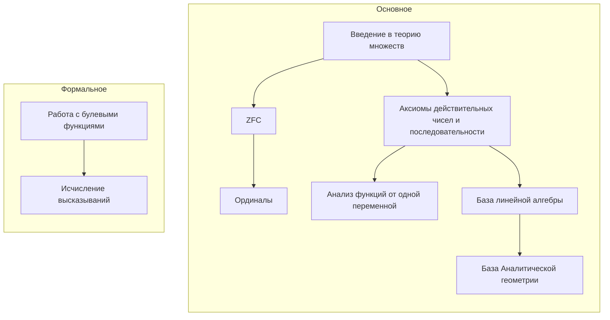
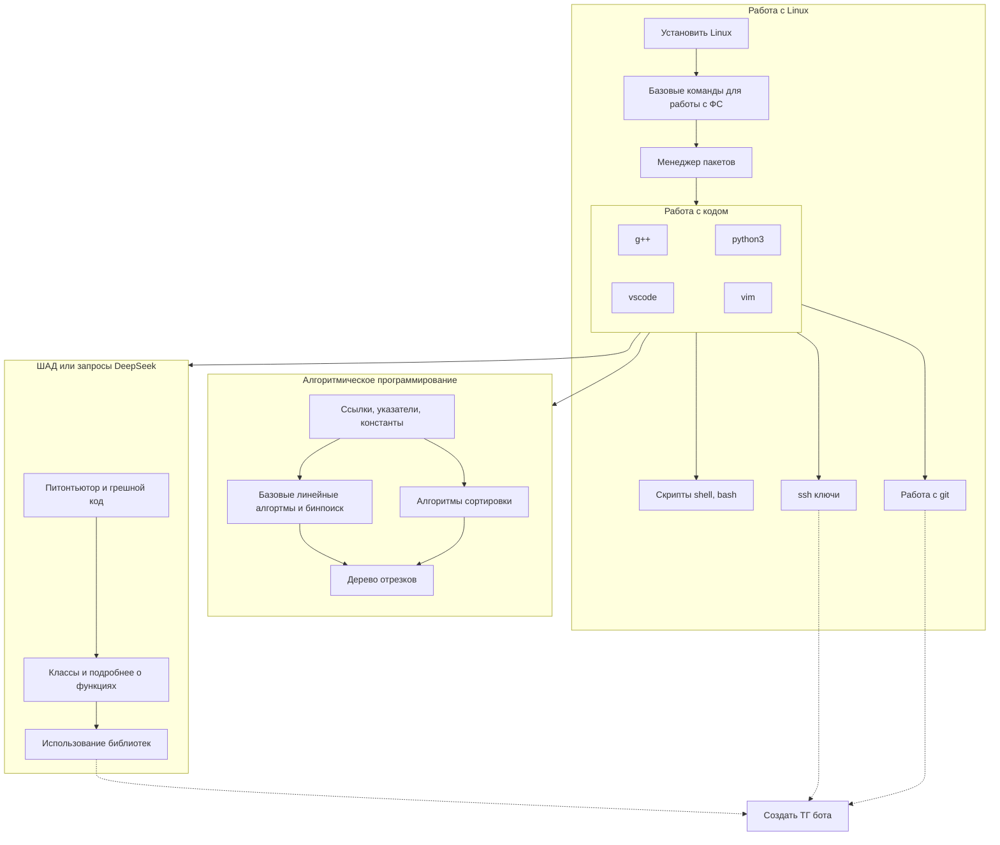

Проект создан как учебное пособие по необязательной подготовке к первому курсу на ФПМИ ПМИ, а так же центр полезных материалов.

План обучения по математическим курсам:

Работа с информационными курсами:

